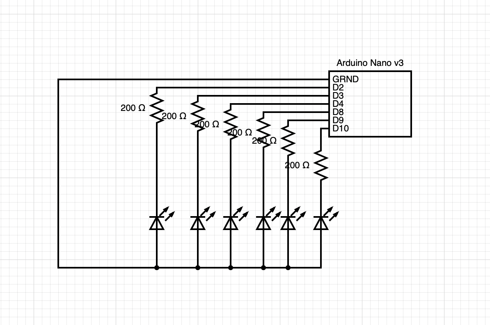

# HW11
 
 This one was a pain! I wanted to use my 6 LEDs so that each would sequentially fade in over the course of 10 seconds until all 6 were lit. The code itself was okay but then the last LED wouldn't light up. I troubleshooted by making sure the wiring was correct and the LED would light up using digitalWrite and no extraneous code, changing to pin 10 in case 12 didn't support analogWrite, reversing the order of the PINS in the sequence, and eventually asking ChatGPT which instructed me to use the serial monitor to make sure that power was going to all the pins correctly (it was). I still don't know what wasn't working! In the end I kept changing things slightly and getting frustrated so I just used digitalWrite and called it a day. If I were to go back in I would have the first LED light up immediately instead of at the end of 10 seconds and also use modulus to have the whole thing cycle. Below is the diagram of my circuit and a video of my clock (sped up).

